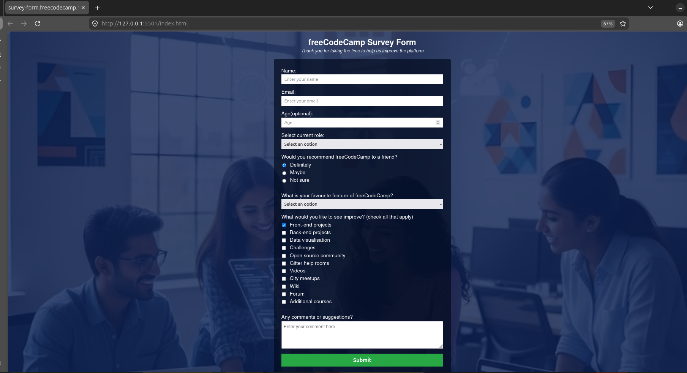

# 🏷 Project Name

freeCodeCamp Survey Form

A responsive survey form built with HTML and CSS, designed to meet the requirements of the freeCodeCamp Responsive Web Design certification.

## 📌 Problem Statement

This project help collect information about users.
Their personal opinions about freeCodeCamp.
Help select the favorite fields each user prefers.
Contain fields to select which ones they desire to see improved.
Finally a sugestion text box.

## 🎯 Project Goals

This is an educational platform that collects information from users easily and their view and suggestions on how to better manage the institution freeCodeCamp.

## 🛠 Tech Stack

- HTML
- CSS

## 🖥 Features

- Information validation fields for typing.
- Semantic HTML which utilizes header, form, and label tags for accessibility.
- Interactive elements such as drop-down menus, radio buttons, and checkboxes.
- Linked to a CSS style sheet for layout and design.

## 📷 Screenshots



## ⚙ Installation & Setup

```bash
git clone https://github.com/Palvett/Survey_form.git
cd Survey_form
```

- **Name:** Fonba Palvett Blaise
- **Role:** Junior Fullstack Developer
- **Email:** palvett406@gmail.com
- **Location:** Based in Cameroon | Open to remote opportunities
